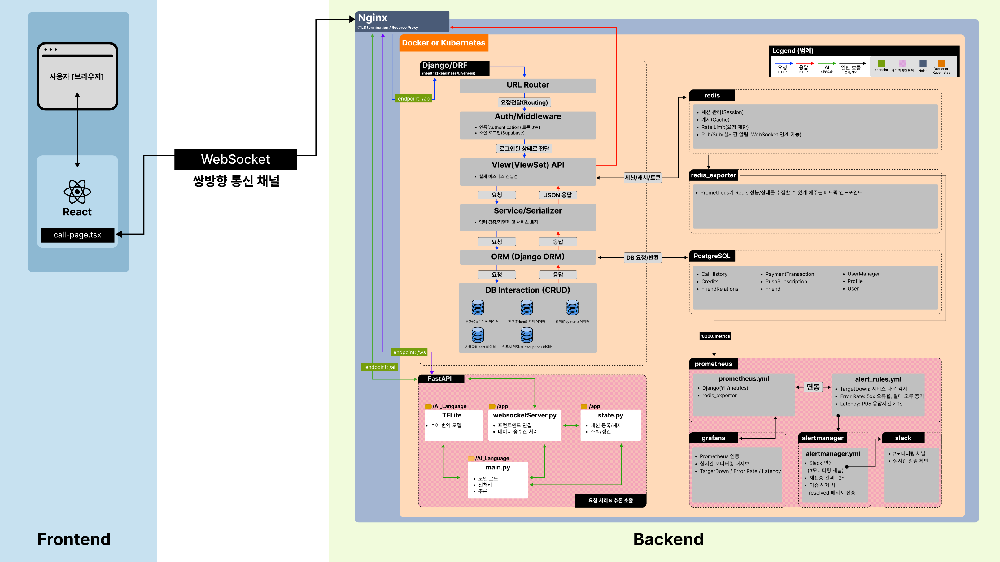

<h1 align="left"> 수어 번역 화상통화</h1>

청각장애인과 비장애인이 원활하게 소통할 수 있는 **화상통화 서비스**입니다.  
사용자의 수어는 **자동으로 인식**되어 **실시간 자막**으로 표시됩니다.  

- **배포 URL** : [https://sign-language-video-call-frontend.vercel.app](https://sign-language-video-call-frontend.vercel.app)

---

<h2 align="left">📖 프로젝트 소개</h2>

- 청각장애인과 비장애인 간 의사소통 장벽을 해소하기 위해 만들어진 **수어 번역 화상통화 서비스**입니다.  
- **WebRTC 기반 화상통화**를 통해 실시간 연결이 가능하며, 사용자의 수어는 **랜드마크 인식 기반 AI 모델**이 추론하여 **자막으로 변환**됩니다.  
- **크레딧 기반 결제 시스템**과 **연락처/통화 내역 관리 기능**으로 서비스 활용도를 높였습니다.  
- 단순한 브라우저 흐름으로 설계하여, **누구나 직관적으로 접근**할 수 있습니다.  

---

<h2 align="left">✨ 주요 기능</h2>

- **회원 관리 & 소셜 로그인** : GitHub, Kakao, Email/Password  
- **연락처 관리** : 요청, 수락/거절, 삭제, 검색  
- **결제 시스템** : 크레딧 충전 및 차감  
- **화상 통화** : WebRTC 기반 실시간 영상통화  
- **실시간 수어 인식 & 자막 변환** :  
  WebSocket으로 전달된 수어 랜드마크 좌표 → TFLite 모델 추론 → 텍스트 자막 변환 → 클라이언트 송신  
- **통화 기록 관리** : 발신자/수신자, 사용 크레딧, 통화 시간  

---
<h2 align="left">📚 기술 스택</h2>
<!-- 인프라 / 운영 -->
<h3 align="left">인프라 / 운영</h3>

   
   
   
  
   

<!-- 백엔드 -->
<h3 align="left">백엔드</h3>

  
  
  

<!-- 프론트엔드 -->
<h3 align="left">프론트엔드</h3>

  
  
  
  

<!-- DB / 결제 / 인증 -->
<h3 align="left">DB / 결제 / 인증</h3>

  
  
  
  

<!-- AI / 실시간 처리 -->
<h3 align="left">AI / 실시간 처리</h3>

  
  
  

---

<h2 align="left">▶️ 시연 영상</h2>

---

<h2 align="left">🖼️ 아키텍처 다이어그램</h2>

## 구성 요소 설명

### Frontend (React)
- **WebRTC**: 영상/음성 스트림 전송
- **WebSocket**: 자막 스트림(수어 → 텍스트) 양방향 송·수신

### Nginx (TLS 종료 + 라우팅)
요청 경로별 백엔드 라우팅:

| Path Prefix | Backend       | 설명                           |
|-------------|---------------|--------------------------------|
| `/api/**`   | Django/DRF    | REST API, 인증 등              |
| `/ai/**`    | FastAPI       | AI 추론 HTTP 엔드포인트        |
| `/ws/**`    | FastAPI       | WebSocket 시그널/자막 스트림   |

### Django / DRF
요청 처리 흐름:
`Auth/Middleware (JWT)` → `URL Router` → `ViewSet / API` → `Service / Serializer` → `ORM` → `PostgreSQL`

- **Auth/Middleware(JWT)**: 인증/권한 검사
- **ViewSet/API & Service/Serializer**: 비즈니스 로직/직렬화
- **ORM → PostgreSQL**: 데이터 영속화

### FastAPI
- **`/ws` WebSocket 서버 (`websocketServer.py`)**: 프론트와 양방향 통신
- **TFLite 추론 (`main.py`)**: 수어 랜드마크 입력 → 자막 텍스트 반환
- **세션/상태 관리 (`state.py`)**: 등록 · 해제 · 조회 · 갱신

### Monitoring
- **Prometheus 스크랩 타깃**: `django /metrics`, `redis_exporter`
- **Grafana 대시보드**: HTTP p95 / 5xx / RPS, CPU·Memory 모니터링
- **Alertmanager 규칙**: `TargetDown`, `5xx > 1% (5m)`, `p95 > 500ms (10m)` → Slack Firing/Resolved 알림

