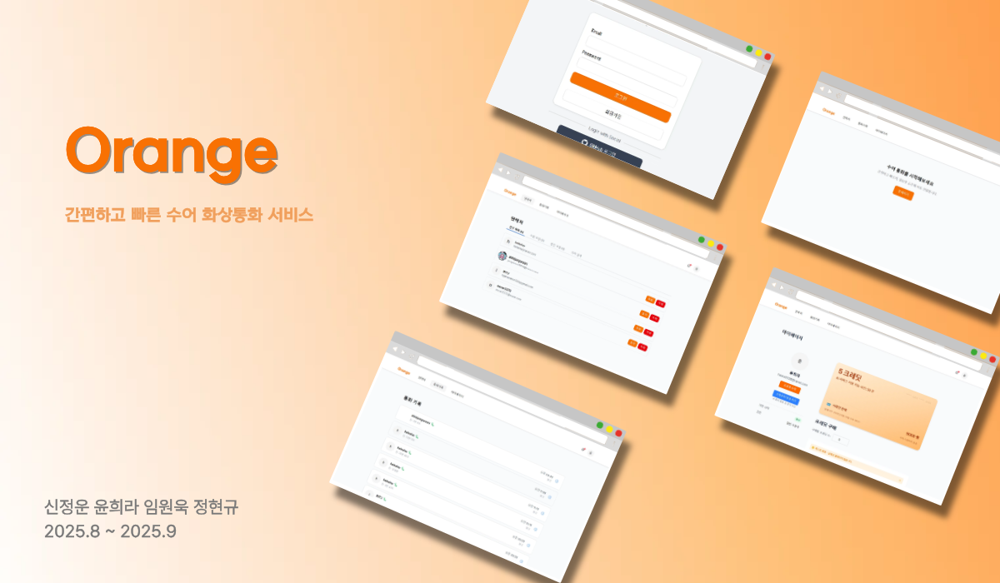

## ***실시간 수어 번역 화상통화***

청각장애인과 비장애인이 원활하게 소통할 수 있는 **화상통화 서비스**입니다.
수어를 **자동으로 인식하고 자막으로 표시**됩니다.

- **배포 URL** : https://sign-language-video-call-frontend.vercel.app

---

##  프로젝트 소개
- 청각장애인과 비장애인 간 의사소통 장벽을 해소하기 위해 만들어진 실시간 수어 번역 화상통화 서비스입니다.
- 사용자는 화상통화 중 수어가 자동으로 인식되고 자막으로 번역되어 원활한 소통을 경험할 수 있습니다.
- 크레딧 기반 결제 시스템과 연락처/통화 내역 관리 기능으로 서비스 활용도를 높였습니다.
- 단순한 브라우저 흐름으로 설계하여, 직관적인 접근이 가능합니다. 

####  주요 기능
- **회원 관리 & 소셜 로그인**  
  (GitHub, Kakao, Email/Password)
- **연락처 관리**  
  요청, 수락/거절,삭제, 검색
- **결제 시스템**  
  크레딧 충전 및 차감
- **화상 통화**  
  WebRTC 기반 실시간 영상통화
- **AI 번역**  
  FastAPI Hub → 수어 좌표(WebSocket) → TFLite 모델 → 자막 변환 → 클라이언트 
- **통화 기록 관리**  
  발신자/수신자, 사용 크레딧, 통화 시간

---
##  수어 번역 과정
이 서비스의 수어 번역은 영상 자체가 아닌 수어 좌표를 입력 받아 추론합니다.

**1.** 수어 좌표 추출
브라우저(React + WebRTC + MediaPipe)에서 수어 좌표를 추출하고, Websocket을 통해 FastAPI hub로 전송됩니다.

**2.** 데이터 라우팅
FastAPI hub는 받은 좌표 데이터를 ai_worker에게 전달합니다.
또한 결과가 다시 클라이언트로 전송할 수 있도록 클라이언트와 ai_worker 간 라우팅합니다. 

**3.** 수어 인식 (TFLite 모델)
좌표가 TFLite 모델에 입력되면 모델은 어떤 수어인지 추론합니다.
결과는 텍스트 형태로 변환됩니다.

**4.** 자막 표시
FastAPI hub는 ai_worker의 추론 결과를 클라이언트로 전송합니다.
브라우저 화면에는 실시간으로 자막이 표시됩니다.

#### 시연 영상 

---
##  아키텍처 설계
### Django REST Framework
- 회원, 연락처·친구, 결제, 통화 기록 등 CRUD 중심의 도메인 API  
**이유**:
인증/권한, Serializer, Admin 등 기존 서비스를 활용하고자 했습니다.  

### FastAPI
- 브라우저로부터 수어 좌표(WebSocket) 수신, 룸 관리 ai_worker로 라우팅, 결과를 클라이언트로 재전송  
 **이유**:
ASGI 기반으로 WebSocket에 강해 성능이 좋습니다.  
    실시간 트래픽 급증이 DRF와 분리하여 안정성 향상하고자 했습니다. 

