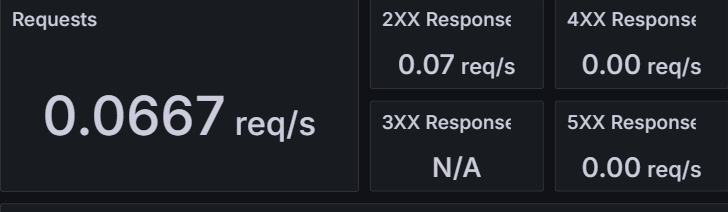
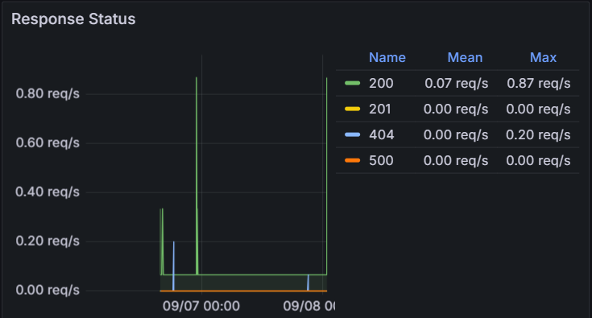
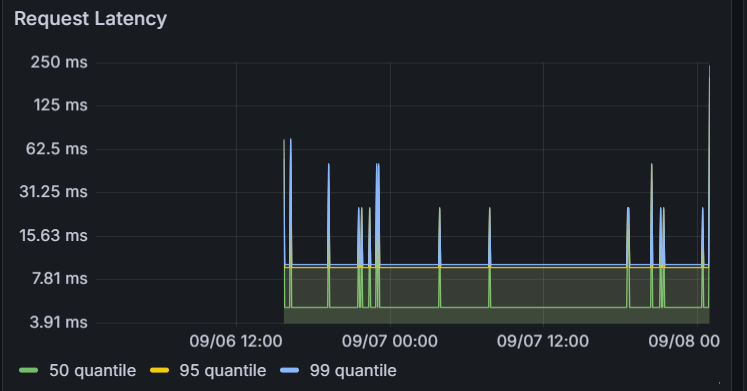

# 모니터링 리포트

## 1. 서론
서비스의 안정성과 문제 조기 인지를 위해 **Prometheus와 Grafana** 기반 모니터링을 구축하였다.  
또한 알림시스템으로 **Alertmanager–Slack 연동**하여, 설정한 규칙이 위반될 시 Slack으로 즉시 알림을 받아 신속하게 대응할 수 있도록 하였다.

리포트에서는 주요 지표 요약, 실제 알림 발생 현황, 그리고 Grafana 대시보드에서 확인한 주요 모니터링 결과를 정리한다.  

## 2. 본론

### 2.1 지표 요약
- **서비스 가용성(uptime)**: up{job="django-backend"} 기반, 최근 주간 100%
- **평균 응답시간**: 현재 트래픽 부재로 수집되지 않음
- **P95 응답시간**:현재 트래픽 부재로 수집되지 않음
- **5xx 오류율**: 현재 트래픽 부재로 수집되지 않음  
    - High5xxErrorRate 알림이 발생한 이력이 있으나 수집되지 않음
    
⚠️트래픽이 없을 경우 Empty query result가 표시된다.

### 2.2 알림 발생 현황
| 발생  | 알림명 | 대상 | 심각도 | 지속 시간 | 비고 |
|-----------|--------|------|--------|------------|------|
| 08/22~09/07 | TargetDown | redis_exporter:9121 | Critical | 하루 ~10회 | 운영 compose에 redis_exporter 추가 |
| 08/22, 9/5 | TargetDown | app:8000 django-backend | Critical | 약 2~5분 | Django 컨테이너 재시작/배포 중 발생 |
| 9/5, 9/6, 9/7 | High5xxErrorRate | app:8000 | Warning | 약 5~7분 | 원인 미확인 |

### 2.3 특이 이슈
- `[FIRING:1] TargetDown redis_exporter:9121 redis (critical)`  
  - **원인**: 운영 환경 `docker-compose.prod.yml` 에 redis_exporter 누락  
  - **조치**: 운영 compose에 redis_exporter 추가 후 해결  

### 2.4 Grafana 대시보드 주요 패널
  - **Requests:**: 초당 요청 수(reqps) 추이
 

       

  - **Response Status**: 2xx/3xx/4xx/5xx 응답 코드 비율
 

  - **Request Latency (P50/P95/P99)**: 지연시간 추이
 

## 3. 결론
모니터링을 통해 Redis Exporter 설정 누락으로 인한 반복 알림을 확인하고 조치하였다.  
전체적으로 서비스는 안정적으로 운영되었으나, 일부 시점에서 5xx 오류율이 발생하여 추가적인 분석이 필요하다.

### 향후 계획
- 5xx 오류율 원인 분석 
- 화상통화 연결 지표 추가

